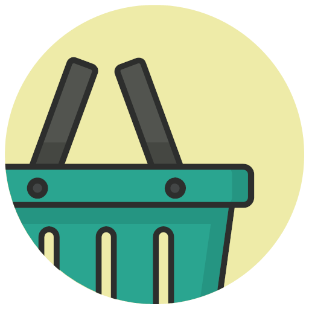

# FCT_Project (ShopBasket)
 Proyecto final ShopBasket

*Icono procedente de https://icons-for-free.com*

## ¿Qué es?

ShopBasket es una aplicación que permite crear listas de la compra con productos que el propio cliente puede crear, teniendo así total libertad y flexibilidad de creación. También es un proyecto de final de grado.

## Interfáz de la Aplicación

## Tecnologías usadas

- **[Java](https://www.java.com/es/)**, lenguaje de programación principal usado para el desarrollo del proyecto.
- **[JavaFX FXML](https://mvnrepository.com/artifact/org.openjfx/javafx-fxml)**, para el diseño de la aplicación
- **[Java Packager](https://github.com/fvarrui/JavaPackager)**, para la creación del instalador.
- **[MySQL](https://www.mysql.com)**, para la base de datos donde se asienta la información.
- **[JavaPackager](https://github.com/fvarrui/JavaPackager)**, para generar los archivos PDFs
